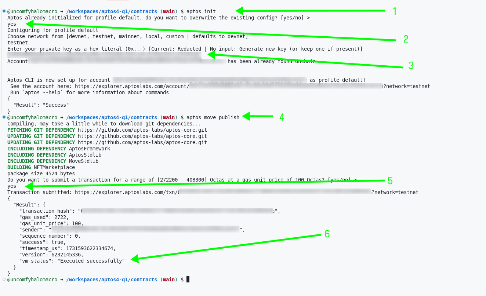

<p align="center">
  <a href="" rel="noopener">
 </a>
</p>
<h3 align="center">APTOS BOUNTY CHALLENGE</h3>

<div align="center">

[](https://shorturl.at/gChca)
[]()
[](https://github.com/alibaba0010/aptos-bounty/issues)
[](https://github.com/alibaba0010/aptos-bounty/pulls)
[](LICENSE.md)

</div>

---

<p align="center"> Few lines describing your project.
    <br> 
</p>

## 📝 Table of Contents

- [Bounty Challenge](#bounty_challenge)
- [Idea / Solution](#idea)
- [Dependencies / Limitations](#limitations)
- [Future Scope](#future_scope)
- [Components and Functionalities added](#usage)
- [Technology Stack](#tech_stack)
- [Contributing](../CONTRIBUTING.md)
- [Authors](#authors)
- [Acknowledgments](#acknowledgments)

## 🧐 Bounty Challenge <a name = "bounty_challenge"></a>

In this Aptos bounty, the foundations from Quest 2 was taken a level higher and the marketplace dApp was pushed to the next level

## 💡 Idea / Solution <a name = "idea"></a>

This section described the functionality added to the project.

- Auction System: Implement an auction feature for NFTs, allowing users to place bids over a set period, with the highest bidder winning the NFT. Ensure the smart contract logic supports tracking and updating bids securely.

- Offer System: Create a feature that allows users to make offers on NFTs listed in the marketplace, enabling sellers to accept or decline incoming offers for their assets.

## ⛓️ Limitations <a name = "limitations"></a>

- Inabilty to handle fees using escrow method: When a user makes an offer, the offer price should be recieved by an escrow account or contract address but couldn't be used n this project. This makes the project subject to review in the future if it has to be deploed to mainnet.

## 🚀 Future Scope <a name = "future_scope"></a>

- Player vs. Player Auctions: Create a head-to-head auction feature where two users can compete to win an NFT by placing escalating bids, with a countdown timer to intensify the competition.

## 🏁 Getting Started <a name = "getting_started"></a>

These instructions will get you a copy of the project up and running on your local machine for development
and testing purposes.

- Git cLone the project

### Prerequisites

Install Aptos CLI on your local machine using the following command

```
curl -fsSL "https://aptos.dev/scripts/install_cli.py" | python3
```

You can check that your installation is working by running the following command.

```
aptos info
```

## Running the project

### ‼️‼️‼️ Copy your wallet address and insert into the

- Move.toml
- NFTMarketplace.move and
- NFTProvider.tsx files

  in the insert_address option

```
cd /smart-contract/contracts run
aptos init
and follow the instruction as shown below to configure your contract for deployment

Still in the directory run
aptos move publish
follow the instructions as shown below
```

```
cd /client run npm install to install all package dependencies for the project
Run
npm start
when packages are installed
```

Example:


```

## 🎈 Components and Functionalities added <a name="usage"></a>

Frontend
Pages
DisplayOffer: Displays NFTs that has been offers from other users, visible only to nftOwner. Handles Accepting and Rejecting Offer functionalities.
Auctions: Displays NFTs that has been auctioned by the nft owner. visible to all users.


Components
Offer: handles offers making functionality.
Auction: handles bid making functionality.
AuctionsCard: child to Auctions page. handles each nfts bid acceptor rejection functionalities, finalize bid functionalities either after finalize bid button clicked or time elapsed.
```

```
Smart contract

TOOD 21 - TODO30
Line 278-484
Functionalities
 - make_offer:  Function to make an offer by any user except the NFT owner
 - show_offers: Function to show NFTs thats has offer made
 - accept_offer: Function to accept the offer made
 - reject_offer: Function to reject an offer made by a user
 - auction_nft: Function to auction  NFT
 - auction_bid_nft: Function to make a bid for an auctioned NFT
 - get_nfts_on_auction: Function to get nfts on auction
 - accept_auction_offer: Function to accept a bid made by a user on a NFt on auction
 - reject_auction_offer: Function to reject an offer made by a user
 - finalize_bid: Function to finalize the bid on an auction either a bid was made or not
   or if the time has elasped
```

Add notes about how to use the system.

## ✍️ Authors <a name = "authors"></a>

- [@alibaba](https://github.com/alibaba0010) - Added some functionalities

## 🎉 Acknowledgments <a name = "acknowledgments"></a>

- [@stackup](https://earn.stackup.dev/) - Idea & Initial work

```

```
